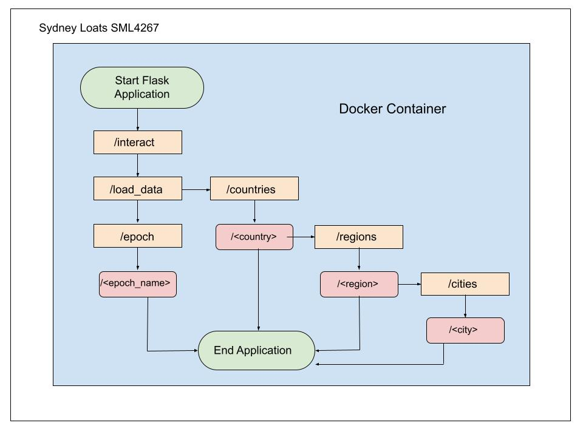

Tracking Position and Sightings Data Diagram
============================================
The following image describes how the application I created on the midterm works. The midterm application uses data about positional local sights of the International Space Station (ISS) based on its trajectory as it orbits Earth. Docker is used to containerize a Flask application to easily retrieve positional and sighting data for the ISS. Positional data is organized by epochs where each epoch has specific positional data. Sighting data is organized by location where each sighting is at a location that has a country, region, and city and each sighting has specific data about the ISS. The Flask application allows the user to narrow their search to easily retrieve information from the data sets.

Diagram
-------

Diagram Explanation
-------------------
This diagram focuses on how the Flask application works and using the curl methods to return positional and sighting data. The top of the diagram shows the first necessary steps to use the application after the Flask application has been started. Follow steps 1 and 2.

1. To understand how the application works, type `curl localhost:5016/interact` to see a list of routes to interact with the application.

2. Then use `curl localhost:5016/load_data -X POST` to load the positional and sighting data. This must be done before you can interact with any of the other routes.

Now we can chose if we want to retrieve positional data or sighting data.

The left part of the diagram after loading the data is to retrieve positional data. Follow steps 1 and 2.

1. Type `curl localhost:5016/epoch` to return a string of all epochs. Each line that is returned is the name of an epoch.

2. To get data about a specific epoch, type `curl localhost:5016/epoch/<epoch-name>` to return a dictionary of the information about a specific epoch. The dictionary has keys that represent the type of information, where the value is the value of that specific piece of information. For example, `curl localhost:5016/epoch/2022-057T12:00:00.000Z` returns:

{  
  "X": {  
    "#text": "6626.5027288478996",  
    "@units": "km"  
  },  
  "X_DOT": {  
    "#text": "-0.48760287876274999",  
    "@units": "km/s"  
  },  
  "Y": {  
    "#text": "-824.23928357807699",  
    "@units": "km"  
  },  
  "Y_DOT": {  
    "#text": "4.9312583060242199",  
    "@units": "km/s"  
  },  
  "Z": {  
    "#text": "-1255.3633426653601",  
    "@units": "km"  
  },  
  "Z_DOT": {  
    "#text": "-5.8454326130222896",  
    "@units": "km/s"  
  }  
}  

where the "#text" is the value and "@units" is the units. In this case, the X coordinate is at about 6626.5 km.

The application ends here for positional data.

The right side of the diagram illustrates how to use the application to retrieve local sighting data. Follow steps 1 and 2.

1. Type `curl localhost:5016/countries` to return a dictionary of all countries and how many sightings occurred in that city.

2. Type `curl localhost:5016/countries/<specific-country>` to return a dictionary of all sightings in that specific country.

To retreive more specific positional data about the region, follow steps 3 and 4, otherwise you can exit the application.

3. Type `curl localhost:5016/countries/<specific-country>/regions` to return a dictionary containing all regions and how many sightings occurred in that city.

4. Type `curl localhost:5016/countries/<specific-country>/regions/<specific-region>` to return a dictionary of all sightings in that specific country and region.

To retrieve more specific positional data about the city, follow steps 5 and 6, otherwise you can exit the application.

5. Type `curl localhost:5016/countries/<specific-country>/regions/<specific-region>/cities` to return a dictionary of all cities and how many sightings occurred in that city.

6. Type `curl localhost:5016/countries/<specific-country>/regions/<specific-region>/cities/<specific-city>` to return a dictionary of all sightings in that specific country, region, and city. For example, `curl localhost:5016/countries/United_States/regions/Wyoming/cities/Basin`

{  
  "United_States, Wyoming, Basin": [  
    {  
      "city": "Basin",  
      "country": "United_States",  
      "duration_minutes": "5",  
      "enters": "10 above S",  
      "exits": "10 above E",  
      "max_elevation": "22",  
      "region": "Wyoming",  
      "sighting_date": "Fri Feb 18/06:00 AM",  
      "spacecraft": "ISS",  
      "utc_date": "Feb 18, 2022",  
      "utc_offset": "-7.0",  
      "utc_time": "13:00"  
    },  
    {  
      "city": "Basin",  
      "country": "United_States",  
      "duration_minutes": "3",  
      "enters": "10 above SSE",  
      "exits": "10 above ESE",  
      "max_elevation": "13",  
      "region": "Wyoming",  
      "sighting_date": "Sat Feb 19/05:13 AM",  
      "spacecraft": "ISS",  
      "utc_date": "Feb 19, 2022",  
      "utc_offset": "-7.0",  
      "utc_time": "12:13"  
    },  

This snip shows the first two sightings. The key is the location (United States, Wyoming, Basin) and the value is all the sightings that occurred in Basin and the data for each sighting.

Citations
---------
Loats, Sydney. "The International Space Station in Earth's Sky." https://github.com/SydneyLoats/tracking-ISS-positions-and-sightings 

